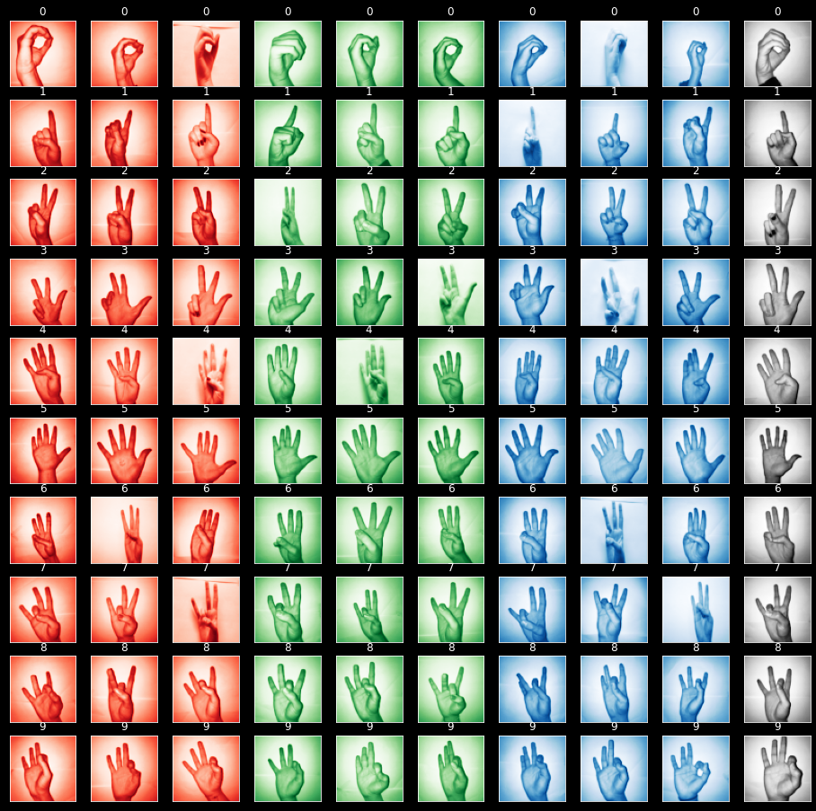

# Cours: Construction de Modèles et leur Déploiement
## Université Virtuelle du Burkina Faso
## TRAVAUX PRATIQUES
## SUJET: Reconnaissance des chiffres en langue des signes
### Enseignant: Mr. KABORE Abdoul Kader
### Membre du groupe
1. ILBOUDO Abdoul Aziz
2. NANA Sidwendluian Romaric
3. ZONGO Celse Darius P.
https://docs.google.com/spreadsheets/d/19bEFJDoPaNbjw41Y3mH6EcJ20usWP0zauYx1BQMznRg/edit#gid=329294994

### DATASET
https://www.kaggle.com/ardamavi/sign-language-digits-dataset/

### RESUMÉ
Les langues des signes sont les langues gestuelles (produites par les mouvements des mains, du visage et du corps dans son ensemble) que les personnes sourdes ont développées pour communiquer. Elles assurent toutes les fonctions remplies par les langues orales. Source: https://fr.wikipedia.org/wiki/Langue_des_signes 

L’objet d’étude est de construire un modèle pouvant reconnaître un chiffre (0-9) à partir d’une image. Le dataset utilisé est constitué d’images représentant les chiffres mimés avec des doigts.

#### VISUALISATION DES DONNÉES

### MATÉRIELS UTILISÉS
1. GIT / GITHUB : pour le versioning du code python
2. DVC / GDrive (Dossier distant): pour le versionning des données, des modèles

### STRUCTURE DU PROJET
* Branche **master**
    - étape de création du dataset
    - étape de prétraitement des données
* Branche **modele-ml**
    - étape d'entrainement d'un modèle SVM (Support Vector Machine)
    - étape d'évaluation du modèle
* Branche **model-rf**
    - étape d'entrainement d'un modèle RF (Random Forest Classifier)
    - étape d'évaluation du modèle
* Branche **modele-cnn**
    - étape d'entrainement d'un réseau de neurones convolutifs (CNN)
    - étape d'évaluation du modèle

### RESULTATS
* Evaluation du modèle RF
    - Accuracy: **0.767**
    - F1-score: **0.764**
* Evaluation du modèle SVC:
    - Accuracy: **0.854**
    - F1-score: **0.853**
* Evaluation du modèle CNN:
    - Accuracy: **0.93**
    - F1-score: **0.93**
 
 ### LIENS UTILES
 - Dépot Github: https://github.com/SROMA226/SignLanguageDetection.git
 - Dossier DVC distant: https://drive.google.com/drive/folders/1JFKaRaH8aJ5Myxbp7NzQ-xY8M9kQrut-?usp=sharing
 - Dataset: https://drive.google.com/drive/folders/1Mar_fO-zClLhoejRinGlViIC5KgMwOQ0?usp=sharing
